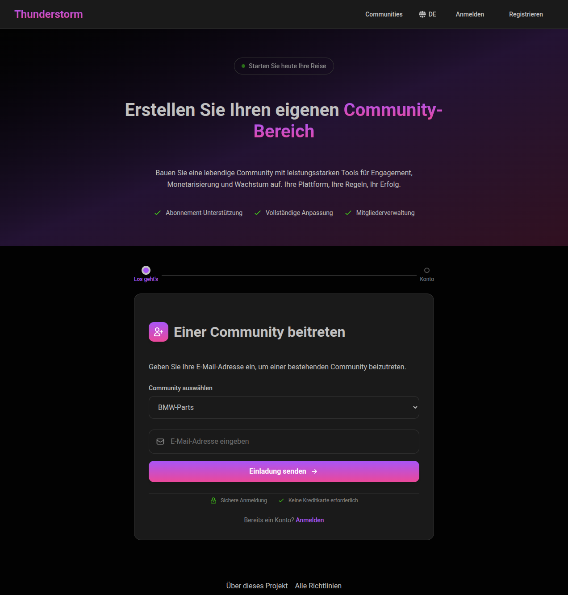
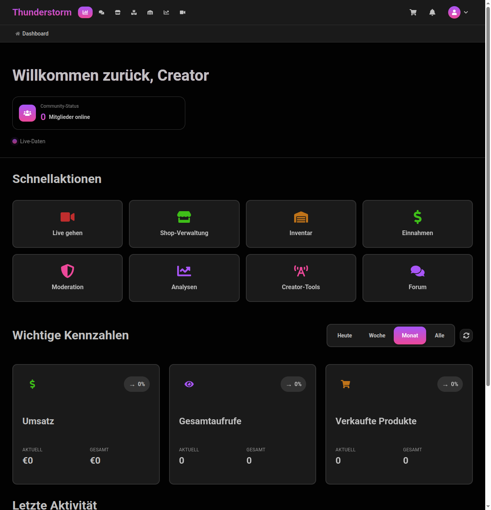
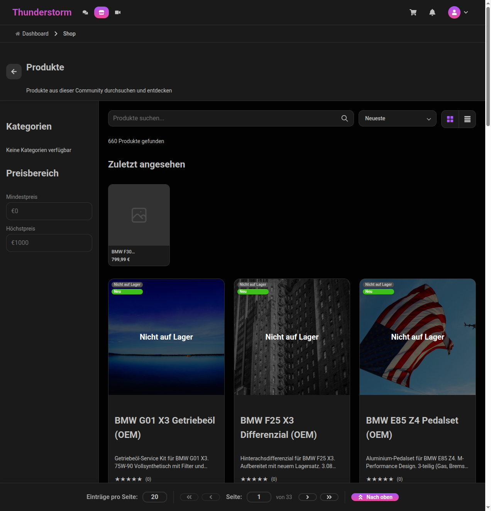
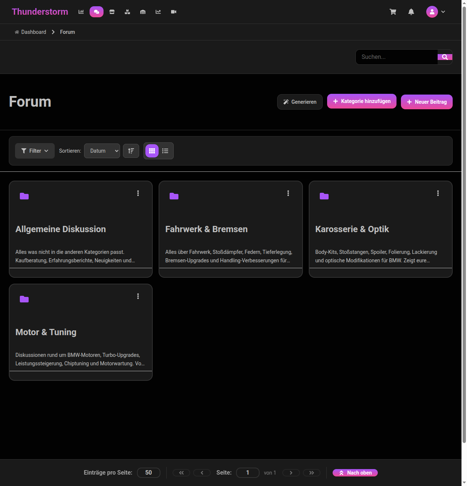
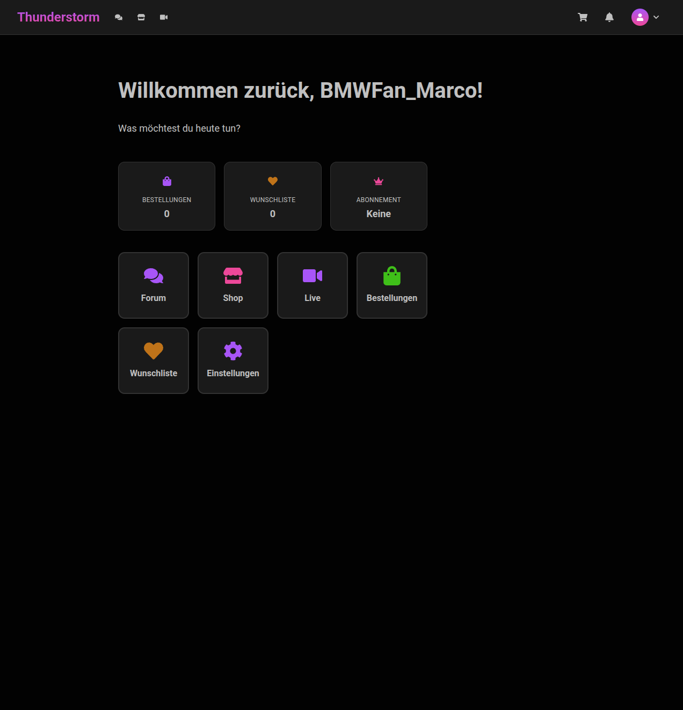

# Thunderstorm Platform — Alpha Testing Guide

Welcome to the Thunderstorm alpha test! You are among the very first people to explore this platform, and your feedback will directly shape the product before public launch. Thank you for taking the time — every bug you find and every impression you share makes a real difference.

**Status**: Alpha | **Started**: March 2026 | **Version**: 1.1

> **ALPHA DISCLAIMER** — Thunderstorm is in active development. Features may change, data may be reset, and some functionality is incomplete. Do not use this platform for real business operations during the alpha period.

---

## Quick Start (2 Minutes)

1. **Open**: [https://ek-thunderstorm.com](https://ek-thunderstorm.com)
2. **Register**: Click **Registrierung** (Register) — choose "User" for browsing or "Creator" to manage a community
3. **Explore**:
   - Browse **Shop** — 660+ products (German names, EUR pricing)
   - Visit **Forum** — read and create discussion posts
   - Check **Live** — live streaming section
4. **Found a bug?** Report it at [GitHub Issues](https://github.com/erso44/Thunderstorm-Feedback/issues/new/choose) using the templates provided

> **Note**: The platform UI is in German. See the [German Glossary](#3-platform-navigation--german-glossary) if you need translations.

---

## What's New

| Date | Update |
|------|--------|
| April 2026 | Alpha testing guide published. Initial release open to first testers. |

*This section will be updated as we ship fixes and new features based on your feedback.*

---

## Table of Contents

1. [Welcome](#1-welcome)
2. [Getting Started](#2-getting-started)
3. [Platform Navigation & German Glossary](#3-platform-navigation--german-glossary)
4. [Features & Test Scenarios](#4-features--test-scenarios)
5. [User Roles](#5-user-roles)
6. [Subscription Plans](#6-subscription-plans-for-community-owners)
7. [Payment Testing](#7-payment-testing)
8. [Your Data & Privacy](#8-your-data--privacy)
9. [Alpha Tester Code of Conduct](#9-alpha-tester-code-of-conduct)
10. [Known Limitations](#10-known-limitations)
11. [How to Report Issues](#11-how-to-report-issues)
12. [Troubleshooting](#12-troubleshooting)
13. [Sharing Your Experience](#13-sharing-your-experience)
14. [FAQ](#14-faq)
15. [Contact](#15-contact)

---

## 1. Welcome

**Thunderstorm** is a creator-first live commerce platform that combines community management, live streaming, and eCommerce into a single experience. Creators can build communities, sell products, and go live — all from one platform. Members can join communities, participate in forums, browse shops, and watch live streams.

**What is alpha testing?** You are among the first external users to explore Thunderstorm. The platform is approximately 80% production-ready. Your role is to explore features, try real workflows, and report anything that feels broken, confusing, or could be improved.

### What We Ask

- **Initial session**: Spend 30–60 minutes exploring the platform following the [test scenarios](#4-features--test-scenarios)
- **Come back**: After we ship updates based on your feedback, we may invite you to re-test. Revisits help us verify that fixes actually work.
- **Report issues**: Use the [bug report template](#11-how-to-report-issues) — the more detail, the faster we can fix it
- **Be responsive**: If we follow up on a report you filed, a quick reply helps us resolve it
- **Be honest**: Critical feedback is the most valuable kind

### What We Especially Want to Learn

- Is the registration flow clear and smooth?
- Can you navigate the platform despite the German interface?
- Does the shop browsing experience feel intuitive?
- Are there any confusing or dead-end screens?

### Platform Preview

Here is what Thunderstorm looks like — so you know what to expect before diving in.

**Registration Page** — where you create your account (German UI with step-by-step flow):



**Creator Dashboard** — the owner view with quick actions, KPIs, and full navigation (Dashboard, Forum, Shop, Inventory, Warehouse, Analytics, Live):



**Shop** — browse 660+ products with search, filters, and price range:



**Forum** — community discussions organized by categories:



**Member Dashboard** — the user view with quick access to Forum, Shop, Live, Orders, Wishlist, and Settings:



---

### Alpha Timeline

| Phase | Timeframe | What Happens |
|-------|-----------|--------------|
| **Alpha** (current) | March–April 2026 | First external testers explore the platform, report bugs, share feedback |
| **Fixes & Iteration** | Ongoing | We fix reported issues and ship updates |
| **Beta** | To be announced | Broader testing with more users and more features |
| **Public Launch** | To be announced | Platform opens to the public |

### Tester Recognition

Alpha testers who actively participate and provide quality feedback will be recognized in our launch credits. You will also receive early access to new features before they go live for the public.

---

## 2. Getting Started

### Platform URL

**[https://ek-thunderstorm.com](https://ek-thunderstorm.com)**

### Supported Environments

| Browser | Status | Notes |
|---------|--------|-------|
| Google Chrome (latest) | Recommended | Primary testing browser |
| Mozilla Firefox (latest) | Supported | Fully functional |
| Microsoft Edge (latest) | Should work | Not actively tested |
| Safari (latest) | Should work | Not actively tested |

**Platform**: Desktop browsers only. Mobile responsiveness may vary during alpha.

**Language**: The platform interface is in **German**. A language switcher is available in the navigation area. See [Section 3](#3-platform-navigation--german-glossary) for a full glossary of German terms.

### Option A: Register as a User (Member)

User accounts can browse communities, participate in forums, shop, and watch live streams.

1. Navigate to `https://ek-thunderstorm.com/registration/user`
2. Fill in:
   - **Benutzername** (Username) — choose a unique username
   - **E-Mail** (Email) — your email address
   - **Passwort** (Password) — see requirements below
3. Click **Registrieren** (Register)
4. You will be redirected to the platform

### Option B: Register as a Creator (Community Owner)

Creator accounts get everything a User can do, plus the ability to manage a community, sell products, view analytics, and manage inventory.

1. Navigate to `https://ek-thunderstorm.com/registration/customer`
2. Fill in your details and choose a community name and type
3. Select a subscription plan (see [Section 6](#6-subscription-plans-for-community-owners))
4. Complete payment with a test card (see [Section 7](#7-payment-testing))
5. You will be redirected to your new community dashboard

> **IMPORTANT — Stripe Connect Onboarding**: After creating your community, you **must complete the Stripe Connect onboarding** to enable checkout and payment flows in your shop. Without this step, your customers will not be able to purchase products. Navigate to your **Dashboard** and follow the Stripe onboarding prompts. Use the Stripe test data (see [Section 7](#7-payment-testing)) to complete the setup.

### Password Requirements

| Requirement | Minimum |
|-------------|---------|
| Length | 8 characters (max 128) |
| Uppercase letter | At least 1 (A-Z) |
| Lowercase letter | At least 1 (a-z) |
| Digit | At least 1 (0-9) |
| Special character | At least 1 (e.g., !@#$%) |

### Multiple Accounts

You can create both a User and a Creator account to test both experiences. Each account requires a **different email address**. You cannot have two accounts with the same email in the same community.

### Session

Your session stays active for 4 hours and automatically refreshes for up to 7 days. If your session expires, simply log in again at `/login`.

---

## 3. Platform Navigation & German Glossary

### Main Navigation Tabs

| German Label | English | What It Does | Who Can See It |
|--------------|---------|--------------|----------------|
| **Dashboard** | Dashboard | Overview with stats and quick actions | Creators only |
| **Forum** | Forum | Community discussions and posts | Everyone |
| **Shop** | Shop | Browse and buy products | Everyone |
| **Live** | Live | Live streaming sessions | Everyone |
| **Inventar** | Inventory | Stock levels, transfers, alerts | Creators only |
| **Lager** | Warehouse | Full warehouse management | Creators only |
| **Analytik** | Analytics | Community and shop metrics | Creators only |

### Common UI Elements

| German Label | English |
|--------------|---------|
| **Warenkorb** | Shopping Cart |
| **Benachrichtigungen** | Notifications |
| **Einstellungen** | Settings |
| **Sammlungen** | Collections / Wishlists |
| **Kasse** | Checkout |
| **Meine Bestellungen** | My Orders |
| **Brotkrümelnavigation** | Breadcrumb Navigation |

### Button Labels

| German | English | | German | English |
|--------|---------|---|--------|---------|
| Erstellen | Create | | Speichern | Save |
| Bearbeiten | Edit | | Löschen | Delete |
| Abbrechen | Cancel | | Bestätigen | Confirm |
| Weiter | Next | | Zurück | Back |
| Schließen | Close | | Suchen | Search |
| Filtern | Filter | | Absenden | Submit |
| Anmelden | Sign In | | Abmelden | Sign Out |
| Registrierung | Register | | Änderungen speichern | Save Changes |
| Bild hochladen | Upload Image | | Entwurf speichern | Save Draft |

### Form Fields

| German | English | | German | English |
|--------|---------|---|--------|---------|
| E-Mail-Adresse | Email Address | | Benutzername | Username |
| Passwort | Password | | Vorname | First Name |
| Nachname | Last Name | | Beschreibung | Description |
| Titel | Title | | Telefonnummer | Phone Number |
| Land | Country | | Stadt | City |
| Postleitzahl | Postal Code | | Vollständiger Name | Full Name |

### Status Messages

| German | English | | German | English |
|--------|---------|---|--------|---------|
| Erfolgreich | Success | | Fehler | Error |
| Wird geladen... | Loading... | | Fehlgeschlagen | Failed |
| Ausstehend | Pending | | Aktiv | Active |
| Bestätigt | Confirmed | | Abgelehnt | Rejected |
| Genehmigt | Approved | | Inaktiv | Inactive |

### Common Nouns

| German | English | | German | English |
|--------|---------|---|--------|---------|
| Produkt | Product | | Bestellung | Order |
| Beitrag | Post | | Kategorie | Category |
| Mitglied | Member | | Mitglieder | Members |
| Nachricht | Message | | Kommentar | Comment |
| Community | Community | | Stream | Stream |

---

## 4. Features & Test Scenarios

Each feature below includes a guided test scenario. Follow the steps and note the expected result. If what you see differs from the expected result, report it as an issue.

### 4.1 Community Browsing & Creation

Browse existing communities or create your own (Creator accounts).

**Test Scenario: Browse Communities**
1. Navigate to `/communities`
2. You should see a list of existing communities with member counts
3. Click on a community to enter it
4. **Expected**: Community page loads with forum, shop, and live tabs

### 4.2 Forum / Discussions

Read and participate in community discussions.

**Test Scenario: Create a Forum Post**
1. Navigate to **Forum** tab within a community
2. Click on a category (e.g., one of the 4 available categories)
3. Click **Neuer Beitrag** (New Post)
4. Enter a title and body text. Try the text editor tools (Fett/Bold, Kursiv/Italic, lists)
5. Click **Absenden** (Submit)
6. **Expected**: Your post appears in the category. You can view it and reply to it.

### 4.3 Shop / eCommerce

Browse the product catalog with 660+ products.

**Test Scenario: Browse and Add to Cart**
1. Navigate to **Shop** tab
2. Browse products — they have German names and images
3. Click on a product to view its details page
4. Click **In den Warenkorb** (Add to Cart)
5. Click **Warenkorb** (Cart) icon in the top navigation
6. **Expected**: Product appears in your cart with price in EUR
7. **Note**: Most products currently show "Nicht auf Lager" (Out of Stock) — see [Known Limitations](#10-known-limitations)

### 4.4 Live Streaming

Explore the live streaming interface.

**Test Scenario: Browse Live Streams**
1. Navigate to **Live** tab
2. **Expected**: Page loads with search, sort, and filter options. Currently shows "0 Streams gefunden" (0 Streams Found) — this is expected as no live streams are active during alpha.

### 4.5 Analytics Dashboard (Creators Only)

View community performance metrics.

**Test Scenario: View Analytics**
1. Navigate to **Analytik** (Analytics) tab
2. **Expected**: Dashboard loads with up to 12 KPI cards showing community metrics
3. Try the time filter options and the **Exportieren** (Export) button

### 4.6 Inventory Management (Creators Only)

View and manage product stock levels.

**Test Scenario: Browse Inventory**
1. Navigate to **Inventar** (Inventory) tab
2. **Expected**: Inventory dashboard shows product list with stock quantities
3. Browse through the product list, check stock levels and alerts

### 4.7 Settings & Profile

Update your account settings and preferences.

**Test Scenario: Update Profile**
1. Click your profile icon (top right) and select **Einstellungen** (Settings)
2. Update your profile information (bio, display name)
3. Click **Änderungen speichern** (Save Changes)
4. **Expected**: Changes are saved. A success message appears.

### 4.8 Payment Flow (Creators Only — Subscription)

Test the subscription payment during creator registration.

**Test Scenario: Complete a Subscription Payment**
1. During creator registration, you will be presented with subscription plans
2. Select a plan (e.g., Starter)
3. Enter the test card number: `4242 4242 4242 4242` (see [Section 7](#7-payment-testing))
4. Complete the payment
5. **Expected**: Payment succeeds. You are redirected to your community dashboard.

---

## 5. User Roles

| Role | Description | Can Access |
|------|-------------|------------|
| **Owner** | Community creator with full control | Everything — Dashboard, Forum, Shop, Inventory, Warehouse, Analytics, Live, Settings |
| **Admin** | Elevated management access | Dashboard, Forum, Shop, Inventory, Analytics, Settings |
| **Moderator** | Content moderation | Forum moderation tools, basic platform access |
| **User** | Standard member | Forum, Shop, Live, Profile, Settings |

**For alpha testing**, we recommend registering as either:
- **User** (via `/registration/user`) — to test the member experience
- **Owner** (via `/registration/customer`) — to test the creator/management experience

---

## 6. Subscription Plans (for Community Owners)

When registering as a Creator, you will choose from these plans:

| Feature | Starter | Pro | Business |
|---------|---------|-----|----------|
| **Monthly Price** | - | - | - |
| **Annual Price** | - | - | - |
| Max Members | 500 | 2,000 | 15,000 |
| Max Products | 50 | 250 | 3,000 |
| Storage | 2 GB | 15 GB | 20 GB |
| Streaming Hours/month | 15 | 80 | 150 |
| Concurrent Streams | 1 | 2 | 3 |
| Max Viewers/Stream | 50 | 200 | 500 |
| Streaming Quality | 720p | 1080p | 1080p |
| Forum Categories | 10 | 25 | 100 |
| Moderators | 3 | 10 | 25 |
| Commission Rate | 20% | 15% | 12% |
| Replay Retention | 14 days | 30 days | 45 days |
| Live Commerce | -- | Yes | Yes |
| Warehouse Management | -- | -- | Yes |
| Analytics | -- | Basic | Full |
| Custom Domain | -- | -- | Yes |
| Priority Support | -- | -- | Yes |
| API Access | -- | Read-only | Full |

**For alpha testing**: All plans work with test payment cards. No real charges will be made. Choose any plan to explore the features available at that tier.

---

## 7. Payment Testing

Thunderstorm uses Stripe in **sandbox (test) mode**. No real money is charged during alpha testing.

**Use only test cards. Do not enter real payment information.**

### Test Card Numbers

| Card Number | Result |
|-------------|--------|
| `4242 4242 4242 4242` | Payment succeeds |
| `4000 0000 0000 0002` | Payment is declined |

**For all test cards, use:**
- **Expiry**: Any future date (e.g., `12/28`)
- **CVC**: Any 3 digits (e.g., `123`)
- **ZIP/Postal code**: Any 5 digits (e.g., `12345`)

All prices are displayed in **EUR**. This is the platform's base currency.

---

## 8. Your Data & Privacy

During the alpha test, we collect:
- **Account data**: Email address, username, password (encrypted)
- **Activity data**: Actions you take on the platform (for testing and improvement purposes)
- **Content**: Any posts, comments, or products you create

**Data retention**: After the alpha test period ends, you may choose to keep your account and data or request full deletion. We will contact all testers before any data changes are made.

**Your rights**:
- You may request deletion of your account and all associated data at any time
- To request deletion, contact: ekthunderstorminfo@gmail.com
- The platform's privacy policy is accessible at [https://ek-thunderstorm.com/privacy-terms](https://ek-thunderstorm.com/privacy-terms)

By participating in this alpha test, you acknowledge the terms above and consent to the collection of data as described for the purpose of platform testing and improvement.

---

## 9. Alpha Tester Code of Conduct

By participating in this alpha test, you agree to:

1. **Use test data only** — Do not enter real personal information beyond your email address. Use fictional names, addresses, and details where prompted.
2. **Keep it appropriate** — Do not post offensive, harmful, or inappropriate content in forums, communities, or product listings.
3. **Keep it confidential** — Do not share your access, screenshots, or details about the platform publicly (social media, reviews, blog posts, etc.).
4. **No automated testing** — Do not perform automated scanning, load testing, penetration testing, or API fuzzing.
5. **Report responsibly** — If you discover a security issue, report it directly via email (see [Section 15](#15-contact)). Do not attempt to exploit it or share it with others.
6. **Respect other testers** — Do not access, modify, or delete other testers' accounts, communities, or content.
7. **Stay responsive** — If we follow up on a bug you reported or ask a clarifying question, please reply when you can. It helps us resolve issues faster.

---

## 10. Known Limitations

The following issues are known and do not need to be reported. We are actively working on fixes.

| # | Issue | Impact |
|---|-------|--------|
| 1 | **Most products show "Nicht auf Lager" (Out of Stock)** | Inventory sync issue — 610/660 products appear out of stock. You can still browse and view product details. |
| 2 | **Checkout may be blocked** | Due to the stock issue above, completing a purchase may fail at the stock reservation step. |
| 3 | **Shop categories show "Keine Kategorien verfügbar"** | Category filters in the shop sidebar are empty. Use search or browse all products instead. |
| 4 | **Some labels in English** | "Cooperative" and "Educational" in the community type selector during registration are not yet translated to German. |
| 5 | **Live streaming shows empty state** | No active live streams exist during alpha. The page loads correctly but shows "0 Streams gefunden" (0 Streams Found). |
| 6 | **Community member count shows "1"** | All communities display "1" member regardless of actual membership. |
| 7 | **Minor error on logout** | A brief technical error may flash on screen when logging out. This does not affect functionality — you are logged out successfully. |
| 8 | **Product detail page may show an error** | Clicking on a product may show "Etwas ist schief gelaufen" (Something went wrong). Try a hard refresh (`Ctrl+Shift+R`). If it persists, it's a temporary deployment issue — you can still browse products from the shop grid. |

---

## 11. How to Report Issues

Found something that is not in the [Known Limitations](#10-known-limitations)? Please report it!

### Where to Report

Go to [**New Issue**](https://github.com/erso44/Thunderstorm-Feedback/issues/new/choose) and choose the template that fits:

| Template | When to Use |
|----------|-------------|
| **Bug Report** | Something isn't working correctly |
| **Feature Request** | An improvement or new idea |
| **General Feedback** | Your overall experience or thoughts |
| **Security Concern** | Non-sensitive security UX issues (for vulnerabilities, email us directly) |

**Response time**: We acknowledge all reports within **48 hours**.

### Bug Report Template

If you prefer to write your own report, please include:

```
**Title**: [Short description of the issue]

**Steps to Reproduce**:
1. [First step]
2. [Second step]
3. [What happened]

**Expected Result**: [What should have happened]

**Actual Result**: [What actually happened]

**Browser & Device**: [e.g., Chrome 122 on Windows 11, Safari on iPhone 15]

**Screenshot**: [Attach if possible]

**Your Username**: [So we can check server logs]
```

### Severity Guide

| Severity | When to Use | Example |
|----------|-------------|---------|
| **Critical** | Cannot use a core feature at all | Cannot register, cannot log in, page crashes |
| **Major** | Feature is broken but a workaround exists | Cannot filter products, but can scroll to find them |
| **Minor** | Cosmetic or non-blocking issue | Misaligned button, untranslated label, slow loading |
| **Suggestion** | Idea or improvement | "It would be nice if..." |

---

## 12. Troubleshooting

Before reporting an issue, try these quick fixes:

| Problem | Try This |
|---------|----------|
| **Page looks broken or outdated** | Hard refresh: `Ctrl + Shift + R` (Windows/Linux) or `Cmd + Shift + R` (Mac) |
| **Cannot log in** | Check username spelling (case-sensitive). Make sure you selected the correct community. Try clearing cookies for `ek-thunderstorm.com`. |
| **Session expired unexpectedly** | Log in again at `/login`. Sessions refresh automatically for up to 7 days. |
| **Buttons don't respond** | Try a different browser (Chrome or Firefox recommended). Disable browser extensions that might interfere. |
| **Page loads but shows no content** | Wait a few seconds — some data loads asynchronously. If still empty after 10 seconds, report it. |
| **Error after an update** | We ship fixes regularly. Clear your browser cache or do a hard refresh to get the latest version. |

If none of these help, please [report the issue](#11-how-to-report-issues).

---

## 13. Sharing Your Experience

Beyond bug reports, we want to hear about your overall experience. You don't need to find a "bug" to give us valuable feedback.

Open a [**General Feedback**](https://github.com/erso44/Thunderstorm-Feedback/issues/new/choose) issue and share your thoughts. Here are some prompts to get you started:

- **What was the most confusing part** of using the platform?
- **What felt intuitive or well-designed?** What worked the way you expected?
- **What feature would you most want improved** before public launch?
- **How was the registration experience?** Smooth? Confusing? Too many steps?
- **Would you recommend this platform to a creator?** Why or why not?
- **Any features you expected but didn't find?**

Every piece of feedback — positive or negative — helps us prioritize what to work on next.

---

## 14. FAQ

**Q: Will I be charged real money?**
A: No. Stripe is in test mode. Use the test card numbers from [Section 7](#7-payment-testing). No real transactions will occur.

**Q: Why is everything in German?**
A: Thunderstorm targets the German-speaking market. A language switcher is available in the navigation area. See the [German Glossary](#3-platform-navigation--german-glossary) for translations of common terms.

**Q: I cannot see the Dashboard, Analytics, or Inventory tabs.**
A: These tabs are only visible to Creator/Owner accounts. Register via `/registration/customer` to access them.

**Q: What happens to my data after the alpha?**
A: After the alpha period, you can choose to keep your account and data or request full deletion. We will contact all testers before any changes are made.

**Q: Can I use the platform on my phone?**
A: The platform is designed for desktop browsers. Mobile responsiveness may vary during alpha.

**Q: How long does my login session last?**
A: Your session stays active for up to 7 days. If it expires, log in again at `/login`.

**Q: How will I know when updates are shipped?**
A: We will update the [What's New](#whats-new) section at the top of this page and may reach out via email for major changes.

---

## 15. Contact

For questions, issues, or feedback:

- **GitHub Issues**: [erso44/Thunderstorm-Feedback](https://github.com/erso44/Thunderstorm-Feedback/issues) — for bugs, feedback, and feature requests
- **Email**: ekthunderstorminfo@gmail.com — for security reports, account deletion, or questions outside GitHub
- **Response time**: Within 48 hours

---

Thank you for being part of the Thunderstorm alpha! Your time and feedback are genuinely appreciated. Every report you file, every suggestion you make, and every impression you share helps us build a better platform for creators and their communities.
